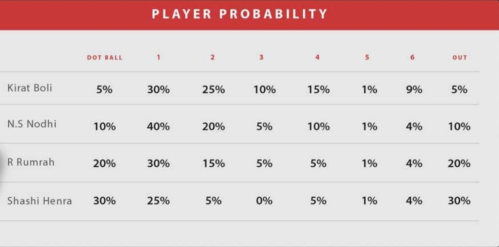

# Cricket Run-Chase Simulator

> _**Using Weighted Random Numbers**_

There are 2 broad algorithms that I have used for generating the random numbers:
   
* **Random Sampling**
* [Fitness Proportionate Selection](https://en.wikipedia.org/wiki/Fitness_proportionate_selection), also known as, _**Roulette Wheel Selection**_


The Random Generator class can provided at run-time via command line arguments. By default, Random Sampling technique is used for generating the scores. More on this is described below.

## Environment
> Python 3 (preferred)


## Steps for running the code
* Create a virtual environment:
    * virtualenv venv/ --python=python3.6

* Clone or download this repository

* Note: no python dependency is required, so running `requirements.txt` is not required anymore

* _cd_ into the project directory

* Start the virtual environment:
    * source `venv/bin/activate`

* Now lets run this project:
    > __python -m app.main__

* The program optionally takes command line argument: 
    >  __python -m app.main --help__
    
* So, if you wish to choose the random generator class for producing aleatory scores, then:

    * For Random Sampling technique -
    > __python -m app.main -rg 'random sampling'__
    
    * For Roulette Wheel Selection technique -
    > __python -m app.main -rg 'roulette selection'__
    

### Problem Context
```
It's the finals of the T20 Cup! Bengaluru and Chennai, neighbours and fierce rivals, are fighting it out for the title. 

Bengaluru's star batsman Kirat is at the crease. Can he win it for Bengaluru? 

Let's simulate the last 4 overs of the match.

It's the last 4 overs of the match. Bengaluru needs 40 runs to win and with 4 wickets left. Each player has a different probability for scoring runs. 

So, the challenge is to simulate the match, ball by ball. The match simulation requires a weighted random number generation based on probability to determine the runs scored per ball.

## Game Rules:
1. Batsmen change strike end of every over. They also change strike when they score a 1,3 or 5.
2. When a player gets out, the new player comes in at the same position.
3. Only legal balls are bowled (no wides, no no-balls etc..). Therefore an over is always 6 balls.

Here is a sample of scoring probabilities of each of the players, shared below.

```



